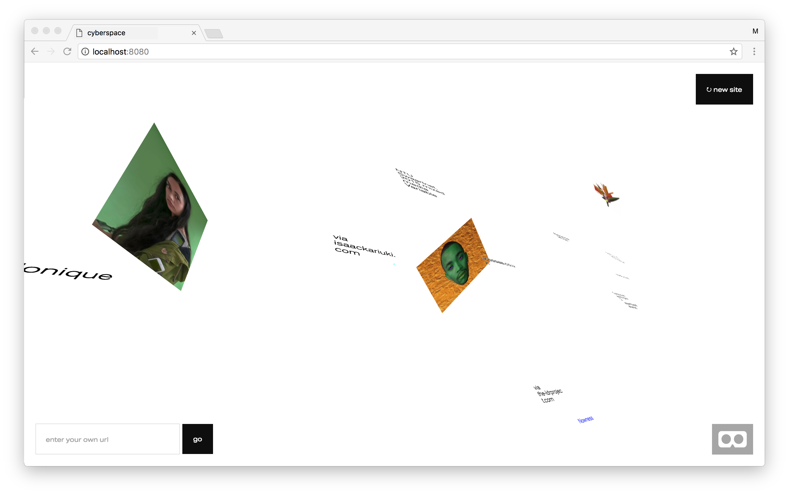
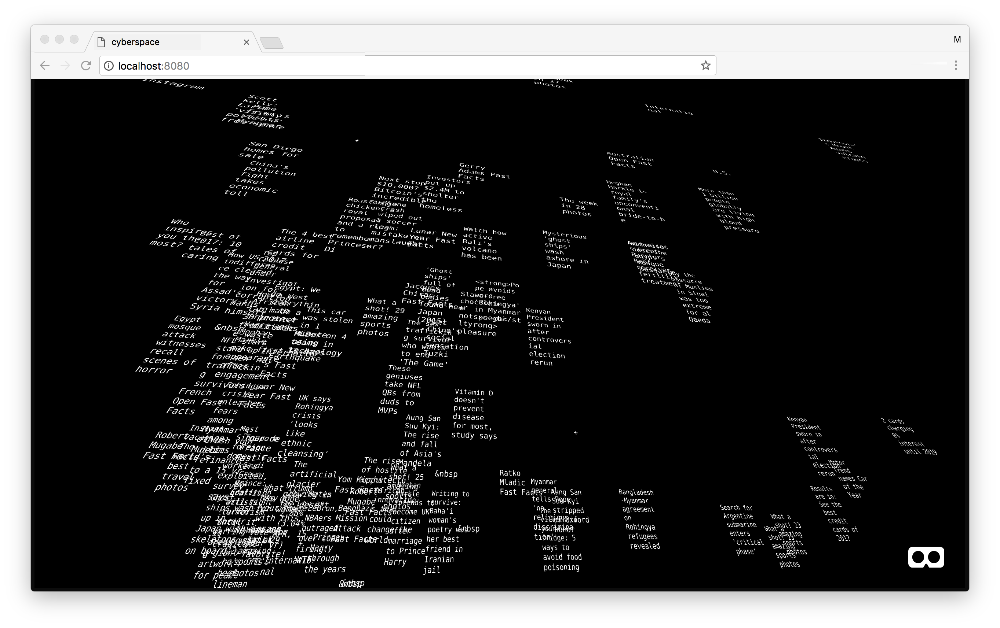

# VR web navigation
An Interactive web experience and virtual reality space which breaks outside of the the 2d context within which we experience a web page. It allows the viewer to navigate through the space of the page, the text and images and interact with it immersively. It configures itself as a postmodernist deconstruction of a website, and a platform through which to consider how we deal with information in a New Media age. 

 

Within this virtual reality environment, there is no hierarchy of content as there would be in a standard website. Elements that would usually be neglected, such as footers, footnotes, terms and conditions, etc. are all given equal weight.

## Using WebVR

 The use of Web VR allows the possibility of cross-browser and cross-platform compatability meaning it can be explored from a regular PC, a mobile device (with or without a 3DoF headset) or with a 6DoF VR headset, democritizing experiences and making them multi-dimensional.